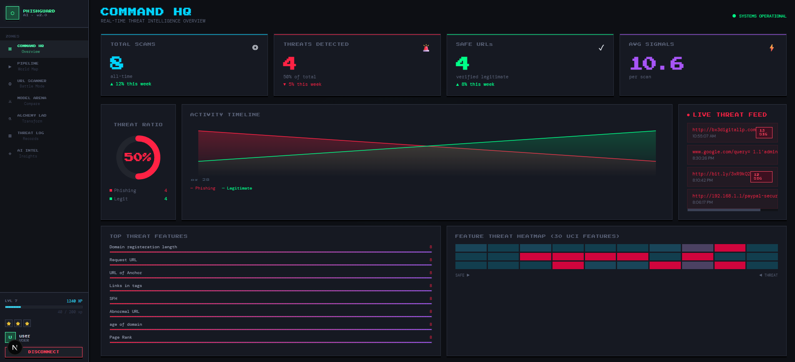

# Network Security — Phishing Detection System

An end-to-end machine learning pipeline for detecting phishing URLs in real time, featuring automated data ingestion, validation, transformation, model training, and cloud deployment on AWS.

---

## Table of Contents

- [Project Overview](#project-overview)
- [Problem Statement](#problem-statement)
- [Dataset](#dataset)
- [Feature Categories](#feature-categories)
- [ML Approach](#ml-approach)
- [Project Structure](#project-structure)
- [Pipeline Architecture](#pipeline-architecture)
- [ETL Pipeline](#etl-pipeline)
- [Components](#components)
  - [Data Ingestion](#1-data-ingestion)
  - [Data Validation](#2-data-validation)
  - [Data Transformation](#3-data-transformation)
  - [Model Trainer](#4-model-trainer)
- [Deployment](#deployment)
- [Setup & Installation](#setup--installation)
- [AWS & GitHub Secrets Configuration](#aws--github-secrets-configuration)
- [Docker Setup on EC2](#docker-setup-on-ec2)

---

## Project Overview

Phishing attacks are one of the most prevalent forms of cybercrime, tricking users into revealing sensitive credentials by mimicking legitimate websites. This project builds a **production-grade machine learning system** that automatically classifies URLs as phishing or legitimate by analysing structural, content-based, and reputation signals extracted from the URL and its associated web page.

The system is designed for real-world deployment — not just model training. It implements a fully automated MLOps pipeline: raw data is ingested from MongoDB, validated for schema compliance and data drift, preprocessed with class-imbalance correction, used to train and evaluate multiple classifiers, and the best model is automatically pushed to cloud infrastructure on AWS. The entire pipeline is triggered and managed through a CI/CD workflow using GitHub Actions and Docker.

---

## Problem Statement

Phishing websites are crafted to closely resemble trusted brands (banks, payment portals, social networks) in order to steal login credentials, financial information, or personal data. Traditional rule-based blocklists cannot keep up with the volume and speed at which new phishing domains are registered — often active for only a few hours before being abandoned.

A machine learning approach addresses this by learning **patterns** across hundreds of known phishing and legitimate sites, then generalising those patterns to flag unseen URLs. This project tackles the binary classification problem:

> Given a set of features extracted from a URL and its web page, predict whether the site is **phishing (-1)** or **legitimate (1)**.

The model is intended to be integrated into network monitoring tools, browser extensions, or security dashboards to provide real-time URL risk scoring.

---

## Dataset

The dataset used is a **phishing URL dataset** containing 30 input features and 1 target label, all encoded as integers. Each row represents a single URL that has been pre-analysed and feature-engineered. The dataset is stored as `phisingData.csv` and loaded into MongoDB Atlas before the training pipeline begins.

| Property | Detail |
|---|---|
| File | `Network_Data/phisingData.csv` |
| Total columns | 31 (30 features + 1 target) |
| Feature types | All `int64` — binary or ordinal encoded |
| Target column | `Result` |
| Target values | `1` = Legitimate, `-1` = Phishing |
| Data source | Extracted from real phishing and legitimate URLs |

The features are derived from three broad sources of evidence: properties of the URL string itself, characteristics of the web page's HTML content, and third-party reputation signals from DNS records, traffic rankings, and blacklists.

---

## Feature Categories

The 30 input features are grouped into six categories, each capturing a different dimension of phishing behaviour:

### 1. URL Structure (8 features)
These features inspect the URL string itself without fetching the page. Phishing URLs often contain telltale patterns such as raw IP addresses instead of domain names, unusually long strings, URL shorteners to hide destinations, the `@` symbol (which causes browsers to ignore everything before it), double-slash redirects, hyphens in domain names, excessive subdomains, and the word "https" embedded in the domain itself (a fake trust signal).

`having_IP_Address` · `URL_Length` · `Shortining_Service` · `having_At_Symbol` · `double_slash_redirecting` · `Prefix_Suffix` · `having_Sub_Domain` · `HTTPS_token`

### 2. SSL / Security (1 feature)
SSL certificate state is a key trust indicator. Legitimate sites almost universally use valid certificates from recognised authorities. Phishing sites may have no certificate at all, a self-signed certificate, or a free certificate obtained purely to display the padlock icon without being a trustworthy entity.

`SSLfinal_State`

### 3. Domain & DNS (4 features)
Phishing infrastructure is ephemeral — attackers register domains for as short a period as possible to minimise cost and avoid long-term blacklisting. These features capture how long a domain has been registered, how old it is, whether a valid DNS record exists, and whether the site's favicon is loaded from a completely different domain (a strong indicator of a cloned site).

`Domain_registeration_length` · `Favicon` · `age_of_domain` · `DNSRecord`

### 4. Page Content (9 features)
Once the page is fetched, its HTML reveals further signals. Phishing pages are often assembled from stolen content and load images, scripts, and stylesheets from the legitimate site they are impersonating, leaving external resource ratios high. Other signals include anchor tags that point nowhere (`#`) or to external domains, form handlers that submit credentials to an unrelated server or directly via email (`mailto:`), hidden iframes used to capture input, non-standard ports, and excessive redirects.

`Request_URL` · `URL_of_Anchor` · `Links_in_tags` · `SFH` · `Submitting_to_email` · `Abnormal_URL` · `port` · `Redirect` · `Iframe`

### 5. Behaviour & Obfuscation (3 features)
JavaScript-level tricks designed to prevent users from discovering the true nature of the site. These include overriding the browser status bar on hover to hide the real link target, disabling right-click to block "View Page Source", and spawning pop-up windows that contain credential forms.

`on_mouseover` · `RightClick` · `popUpWidnow`

### 6. External Reputation (5 features)
Third-party signals that are hard for attackers to fake. A newly created phishing domain will have near-zero web traffic, no PageRank, no Google index presence, almost no inbound links, and may already appear in phishing report databases like PhishTank or StopBadware.

`web_traffic` · `Page_Rank` · `Google_Index` · `Links_pointing_to_page` · `Statistical_report`

### Target Label

`Result` — the binary class label. Encoded as `1` for legitimate and `-1` for phishing in this dataset.

---

## ML Approach

The pipeline trains and evaluates multiple scikit-learn classifiers through a **Model Factory** pattern. The best-performing model — measured against a configurable expected accuracy threshold — is selected and wrapped together with the fitted preprocessor into a single serialised `NetworkSecurityModel` object (`model.pkl`).

**Preprocessing strategy:**
- **KNN Imputer** — handles missing values by inferring them from the k nearest neighbours in feature space, preserving data structure rather than substituting a global mean.
- **Robust Scaler** — scales features using the interquartile range rather than mean/std, making it resilient to the outliers common in web traffic and URL length features.
- **SMOTETomek** — addresses class imbalance in the training set by synthetically oversampling the minority class (SMOTE) and cleaning ambiguous boundary samples (Tomek links). Applied only to the training data; test data is never resampled.

**Model selection:** The Model Factory evaluates multiple classifiers and picks the one with the highest score above the expected accuracy threshold. If no model meets the threshold, the pipeline raises an exception rather than pushing an underperforming model to production.

**Prediction modes:**
- **Training pipeline** (`main.py`) — end-to-end retraining from raw data to saved model
- **Batch prediction** (`batch_prediction.py`) — run inference on new URL datasets and write results to `prediction_output/output.csv`
- **Real-time API** (`app.py`) — serve single-URL predictions via HTTP, returning a risk classification

---

## Project Structure

```
C:.
├── app.py                     # FastAPI/Flask application entry point
├── main.py                    # Training pipeline runner
├── push_data.py               # Script to push data to MongoDB
├── requirements.txt
├── setup.py
├── Dockerfile
├── README.md
│
├── .github/
│   └── workflows/
│       └── main.yml           # CI/CD GitHub Actions workflow
│
├── networksecurity/           # Core package
│   ├── cloud/
│   │   └── s3_syncer.py       # S3 artifact sync
│   ├── components/
│   │   ├── data_ingestion.py
│   │   ├── data_validation.py
│   │   ├── data_transformation.py
│   │   └── model_trainer.py
│   ├── constant/
│   │   └── training_pipeline/
│   ├── entity/
│   │   ├── artifact_entity.py
│   │   └── config_entity.py
│   ├── exception/
│   │   └── exception.py
│   ├── logging/
│   │   └── logger.py
│   ├── pipeline/
│   │   ├── training_pipeline.py
│   │   └── batch_prediction.py
│   └── utils/
│       ├── main_utils/utils.py
│       └── ml_utils/
│           ├── metric/classification_metric.py
│           └── model/estimator.py
│
├── Artifacts/                 # Timestamped pipeline run outputs
├── data_schema/
│   └── schema.yaml
├── final_model/
│   ├── model.pkl
│   └── preprocessor.pkl
├── Network_Data/
│   └── phisingData.csv        # Raw dataset
├── logs/                      # Timestamped log files
├── prediction_output/
│   └── output.csv
├── templates/
│   └── table.html
└── valid_data/
    └── test.csv
```

---

## Pipeline Architecture

The system is built around a sequential ML pipeline where each component produces **artifacts** consumed by the next stage:

```
MongoDB Database
      │
      ▼
Data Ingestion  ──(Config)──►  Data Validation  ──(Config)──►  Data Transformation
      │                               │                                │
      ▼                               ▼                                ▼
  Artifacts                       Artifacts                        Artifacts
                                                                        │
                                                                        ▼
                                                               Model Trainer ──(Config)──►  Model Evaluation
                                                                                                    │
                                                                                          Model Accepted?
                                                                                           Yes ──► Model Pusher ──► Cloud (AWS / Azure)
                                                                                           No  ──► None
```

Each stage is driven by a dedicated **Config** object and outputs an **Artifact** entity for traceability.

---

## ETL Pipeline

Data flows through an Extract → Transform → Load (ETL) process before entering the ML pipeline.

### Extract (Sources)
- Local CSV dataset (`phisingData.csv`)
- REST APIs / Paid APIs
- S3 Buckets
- Internal Databases

### Transform
- Basic preprocessing and cleaning of raw data
- Conversion to JSON format for MongoDB ingestion

### Load (Destinations)
- **MongoDB Atlas** (primary store)
- AWS DynamoDB
- MySQL
- S3 Buckets

**Example — CSV row to MongoDB document:**
```
A    B    C
100  120  140   →  {"A": 100, "B": 120, "C": 140}  →  MongoDB
```

---

## Components

### 1. Data Ingestion

Reads raw phishing data from MongoDB, exports it to a feature store, drops irrelevant columns (per schema), and splits the data into train/test CSV files.

**Config inputs:**
- Data Ingestion Directory
- Feature Store File Path
- Training / Testing File Paths
- Train-Test Split Ratio
- Collection Name

**Flow:**
```
Data Ingestion Config
        │
        ▼
Initiate Data Ingestion ◄── MongoDB (raw pull)
        │
        ▼
Export Data to Feature Store  →  Raw.csv (timestamped)
        │
        ▼
     Drop Columns  (per schema.yaml)
        │
        ▼
Split Data: Train / Test  →  train.csv / test.csv (Ingested folder, timestamped)
```

**Artifact outputs:** `train.csv`, `test.csv`

---

### 2. Data Validation

Validates ingested data against the schema before transformation. Checks for data drift.

**Three validation checks:**
1. **Same Schema** — same number of features as defined in `schema.yaml` (10 features)
2. **Data Drift** — detects distribution shift between train and test sets; generates a drift report
3. **Column Validation** — validates number of columns and existence of numerical columns

**Flow:**
```
Data Ingestion Artifact (train.csv, test.csv)
        │
        ▼
Read Data → Validate No. of Columns → Is Numerical Columns Exist
        │                 │                        │
     Train Status      Test Status              Train/Test Status
        │
        ▼
Drift Status ──► Detect Dataset Drift ──► Data Drift Report
        │
        ▼
Validation Status ──► True:  Valid data paths
                  └──► False: Validation Error
```

**Artifact outputs:** `valid_train.csv`, `valid_test.csv`, `invalid_train.csv`, `invalid_test.csv`, `drift_report.yaml`

---

### 3. Data Transformation

Applies preprocessing to validated data and handles class imbalance before model training.

**Key techniques:**
- **KNN Imputer** — fills missing values using k-nearest neighbours
- **Robust Scaler** — scales features, robust to outliers
- **SMOTETomek** — handles class imbalance via oversampling (SMOTE) + cleaning (Tomek links)

**Flow:**
```
Data Validation Artifact (train.csv, test.csv)
        │
        ▼
Initiate Data Transformation
        │
        ├──► Drop Target Column → Target Value Mapping
        │
        ├──► Get Preprocessor Object (KNN Imputer + Robust Scaler)
        │         fit-transform on Train    transform on Test
        │
        ├──► SMOTETomek (applied on Train only)
        │
        └──► Save Preprocessor Object → preprocessing.pkl
                │
                ▼
        train.npy  /  test.npy  (numpy arrays)
                │
                ▼
        Data Transformation Artifact
```

**Artifact outputs:** `train.npy`, `test.npy`, `preprocessing.pkl`

---

### 4. Model Trainer

Trains multiple models via a **Model Factory**, selects the best one based on expected accuracy, and saves it.

**Config inputs:**
- Model Trainer Directory
- Trained Model File Path
- Expected Accuracy threshold
- Model Config File Path

**Flow:**
```
Data Transformation Artifact (train.npy, test.npy, preprocessing.pkl)
        │
        ▼
Load numpy arrays → Split into X_train, y_train, X_test, y_test
        │
        ▼
Model Factory → Train & Calculate Metrics → Get Best Model
        │
  best_score ≥ expected_accuracy?
        │
   Yes  └──► Load preprocessing.pkl → Build NetworkSecurityModel
        │         (model.pkl wraps estimator + preprocessor)
        │
        ▼
Model Trainer Artifact → model.pkl + metric_artifact
```

**Artifact outputs:** `model.pkl`, `metric_artifact`

---

## Deployment

The application is containerised with Docker and deployed to **AWS EC2** via a CI/CD pipeline using GitHub Actions.

```
Network Security App
        │
        ▼ (1) Build Docker Image
    AWS ECR  ◄── Push image
        │
        ▼ (2) GitHub Actions CD Pipeline
    App Runner ──► AWS EC2
```

**Steps:**
1. On push to `main`, GitHub Actions triggers the CI pipeline
2. Docker image is built and pushed to **AWS ECR**
3. CD pipeline pulls the image from ECR and deploys to **AWS EC2** via App Runner

---

## Setup & Installation

```bash
# Clone the repository
git clone <your-repo-url>
cd networksecurity

# Install dependencies
pip install -r requirements.txt

# Install the package
python setup.py install

# Push raw data to MongoDB
python push_data.py

# Run the training pipeline
python main.py

# Start the application
python app.py
```

---

## AWS & GitHub Secrets Configuration

Add the following secrets to your GitHub repository under **Settings → Secrets and Variables → Actions**:

| Secret | Description |
|---|---|
| `AWS_ACCESS_KEY_ID` | AWS IAM access key |
| `AWS_SECRET_ACCESS_KEY` | AWS IAM secret key |
| `AWS_REGION` | `us-east-1` |
| `AWS_ECR_LOGIN_URI` | `788614365622.dkr.ecr.us-east-1.amazonaws.com/networkssecurity` |
| `ECR_REPOSITORY_NAME` | `networkssecurity` |

---

## Docker Setup on EC2

SSH into your EC2 instance and run the following commands to install Docker:

```bash
# Update packages
sudo apt-get update -y
sudo apt-get upgrade -y

# Install Docker
curl -fsSL https://get.docker.com -o get-docker.sh
sudo sh get-docker.sh

# Add user to docker group
sudo usermod -aG docker ubuntu
newgrp docker
```

After setup, the GitHub Actions CD pipeline will automatically pull and run the latest Docker image on this EC2 instance.

---

## Tech Stack

| Layer | Technology |
|---|---|
| Language | Python 3.10 |
| ML Framework | scikit-learn |
| Imbalance Handling | imbalanced-learn (SMOTETomek) |
| Data Store | MongoDB Atlas |
| Cloud Storage | AWS S3 |
| Containerisation | Docker |
| Container Registry | AWS ECR |
| Hosting | AWS EC2 |
| CI/CD | GitHub Actions |
| Web Framework | FastAPI / Flask |
